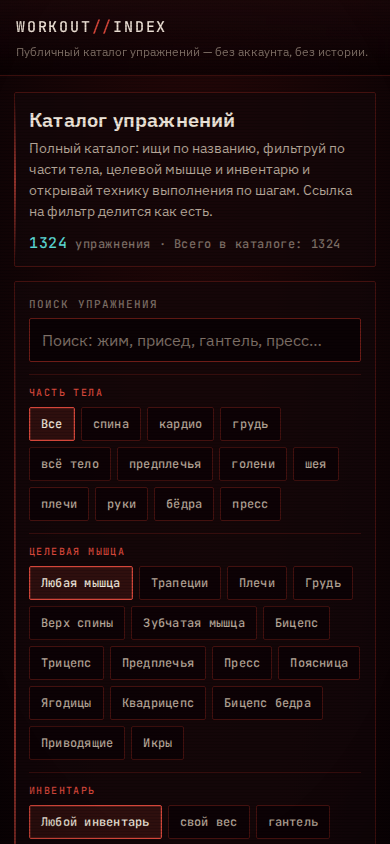
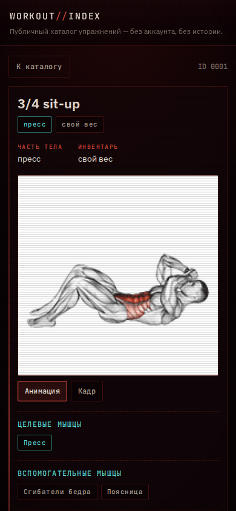
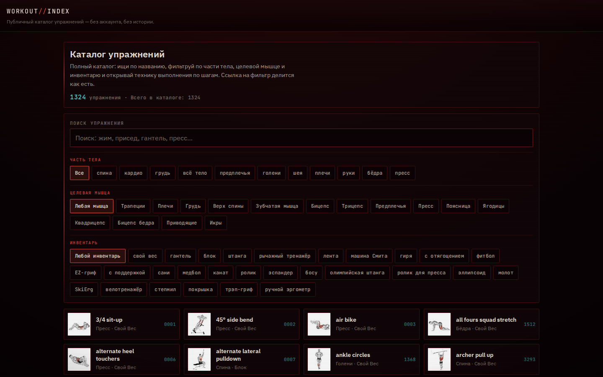
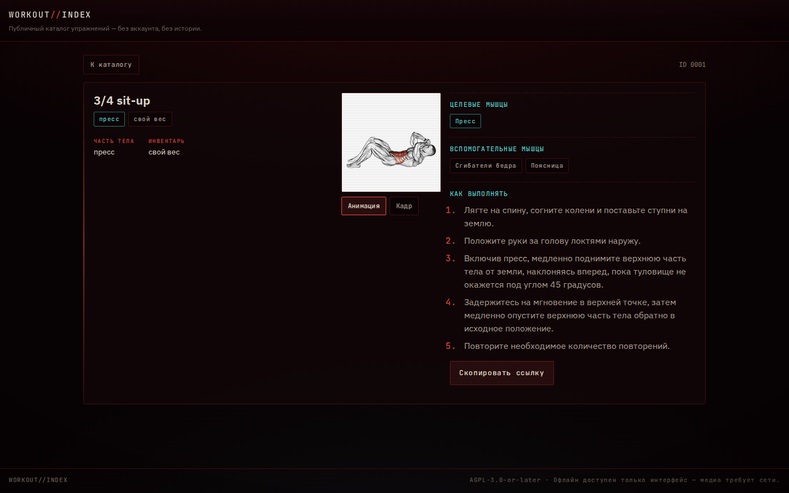

# WORKOUT//INDEX

Публичный каталог упражнений: **1324 упражнения** с техникой выполнения по шагам, целевыми и
вспомогательными мышцами, инвентарём и анимацией. Статическое приложение без бэкенда, базы
данных, аккаунтов и истории — открываешь ссылку и читаешь.

**Публичный адрес:** <https://workout.xtr.sh>

| Каталог (390 px) | Карточка упражнения (390 px) |
|---|---|
|  |  |

| Каталог (1440 px) | Карточка упражнения (1440 px) |
|---|---|
|  |  |

## Что умеет

- **Каталог `/`** — полный список 1324 упражнений, пагинация по 36 карточек, ленивые миниатюры.
- **Поиск** — по каноническому английскому названию и по русским фасетам и тексту инструкций,
  с терпимостью к одной опечатке в длинном слове (`bnech press` находит `bench press`).
- **Фильтры** — часть тела, целевая мышца, инвентарь; выбранное состояние живёт в URL
  (`/?q=…&body=…&muscle=…&equipment=…`), поэтому ссылкой можно делиться, а «назад/вперёд»
  восстанавливают вид, включая текст поиска и позицию списка.
- **Карточка `/exercise/:id`** — английское название, часть тела и инвентарь по-русски, целевые
  и вспомогательные мышцы, переключатель «анимация / кадр» и раздел **«Как выполнять»** с полным
  русским текстом инструкции. Прямая ссылка и жёсткое обновление работают.
- **PWA** — манифест, своя иконка и service worker, который кеширует только оболочку
  приложения, собранную этим билдом. После одного успешного захода интерфейс открывается
  офлайн; медиа офлайн показывает обычный фолбэк.
- **Тема DAEMON CRT** — почти чёрный oxblood-фон, тонкие красные рейки, циановая телеметрия
  для счётчиков, сканлайны, виньетка и медленный свип монитора. При
  `prefers-reduced-motion` анимации отключаются, тема остаётся читаемой.
- **Доступность** — семантические кнопки с `aria-pressed`, видимый фокус, tap-targets от 34–44 px,
  отсутствие горизонтального скролла на 320 px.

### Чего здесь сознательно нет

Это не трекер тренировок. Нет планов, программ, сессий, истории, рекордов, избранного, профиля,
регистрации, пользовательских упражнений, ИИ, платежей, API, серверной базы и админки. Ни одной
кнопки, которая меняет состояние.

## Архитектура

```
src/
  data/            извлечённые данные (генерируются скриптом, не редактируются руками)
    exercises.json      1324 упражнения: id, английское название, часть тела, инвентарь,
                        целевая мышца, вспомогательные мышцы, имена файлов медиа
    muscle-overlays.json 239 одобренных правок мышечных групп (batches 1/2 + Olympic)
    instructions.ru.json полный русский пак инструкций, 1324 записи
    facets.ru.json       русские названия частей тела, инвентаря и мышц
  lib/
    catalogue.js   композиция каталога (сырой датасет + оверлей), фасеты, поиск
    muscles.js     словарь мышц: алиасы датасета → канонические id, русские названия
    filters.js     контракт URL: разбор, валидация и сериализация фильтров
    media.js       URL медиа на закреплённом CDN-коммите + автомат состояний показа
    i18n.js        русские строки интерфейса
    pwa.js         регистрация service worker
  views/           Catalogue, Exercise
  components/      Thumb, Media
  styles/theme.css тема DAEMON CRT
scripts/
  extract-source-data.mjs  одноразовое детерминированное извлечение данных из исходника
  build-sw.mjs             генерация service worker из реального dist/
  make-icons.py            оригинальные иконки проекта (Pillow)
  verify-browser.mjs       браузерная проверка собранного приложения
tests/             60 unit/компонентных тестов (vitest + happy-dom)
deploy/
  nginx.conf        статический сервер: кеш, SPA-фолбэк, /healthz
  workout.caddy     версионируемая копия фрагмента ingress
```

**Русский язык.** Названия упражнений остаются каноническими английскими: русский пак имён в
датасете отсутствует, а машинно-транслитерировать 1324 названия значит выдумывать данные.
Переведено всё, что говорит интерфейс: части тела, инвентарь, мышцы, подписи и полный текст
инструкций.

**Медиа не лежит в репозитории.** Изображения и анимации — сторонний контент с нерешёнными
правами (см. [NOTICE.md](NOTICE.md)). Приложение грузит их в рантайме с закреплённого коммита
CDN, а в образ и в кеш service worker они не попадают.

## Локальная разработка

Нужен Node.js 20+ (проверено на 24).

```bash
npm ci
npm run dev          # http://localhost:5173
npm test             # 60 тестов
npm run build        # сборка dist/ + генерация service worker
npm run preview      # предпросмотр production-сборки
```

Данные уже закоммичены в `src/data/`. Пересобрать их из исходного проекта (нужен доступ к его
дереву) можно так:

```bash
node scripts/extract-source-data.mjs --source /path/to/source/frontend/src
```

Скрипт детерминирован: повторный запуск даёт байт-в-байт тот же результат, падает, если меняется
схема исходных данных, если у упражнения нет русской инструкции или если у фасета нет русского
названия.

## Docker и деплой

Приложение — статический контейнер (nginx, порт **8080**), который живёт за общим edge-прокси.

```bash
docker compose build
docker compose up -d
docker compose ps            # healthcheck должен быть healthy
docker compose config -q     # валидация compose
```

Особенности конфигурации:

- образ `workout-xtr:<version>`, контейнер `workout-xtr-app`;
- внешняя сеть `girl-xtr_girl_edge` с уникальным алиасом `workout-app`, **порты наружу не
  публикуются**;
- `read_only`, `tmpfs`, `cap_drop: [ALL]`, `no-new-privileges`, политика перезапуска и healthcheck;
- секретов нет — приложение публичное и статическое.

Ingress-фрагмент (`deploy/workout.caddy` → `/opt/obsidian-livesync/caddy/workout.caddy`) принимает
трафик только от Cloudflare и проксирует на `workout-app:8080`. Общий прокси читает каталог
`sites/` только при старте, поэтому фрагмент активируется рестартом **shared proxy**, а не
приложения. Проверка фрагмента без остановки живого прокси:

```bash
docker run --rm --network girl-xtr_girl_edge \
  -v /opt/obsidian-livesync/caddy:/etc/caddy/sites:ro \
  -v /tmp/cval:/etc/cval:ro \
  caddy:2.10.2-alpine caddy validate --config /etc/cval/Caddyfile --adapter caddyfile
```

## Проверки

```bash
npm test                 # unit + компонентные тесты
npm run build            # production-сборка
npm run preview &        # сервер собранного артефакта
PLAYWRIGHT_MODULE=/path/to/playwright BASE_URL=http://localhost:4173 \
  node scripts/verify-browser.mjs
```

Браузерный набор проверяет собранный артефакт, а не исходники: HTTP-коды, вёрстку на 320/390/1440,
жёсткое обновление на `/exercise/0001`, состояние поиска и фильтров в URL, фолбэк при недоступном
CDN, клавиатурный путь, reduced motion, офлайн после прогретого визита и — через
`CSS.getPlatformFontsForNode` — что кириллицу реально рисует поставляемый шрифт, а не подстановка
платформы. Playwright намеренно не в зависимостях проекта: приложение должно ставиться и
собираться без него.

## Лицензия

**AGPL-3.0-or-later** — см. [LICENSE](LICENSE).

Это производная работа: срез каталога упражнений извлечён из AGPL-проекта. Обязательная
атрибуция и источник указаны в [NOTICE.md](NOTICE.md).

## Оговорка по медиа

Изображения и анимации упражнений — сторонние, их права не урегулированы, и они **не**
распространяются вместе с этим проектом (ни в репозитории, ни в образе, ни в кеше). Подробности и
требуемая атрибуция — в [NOTICE.md](NOTICE.md).
